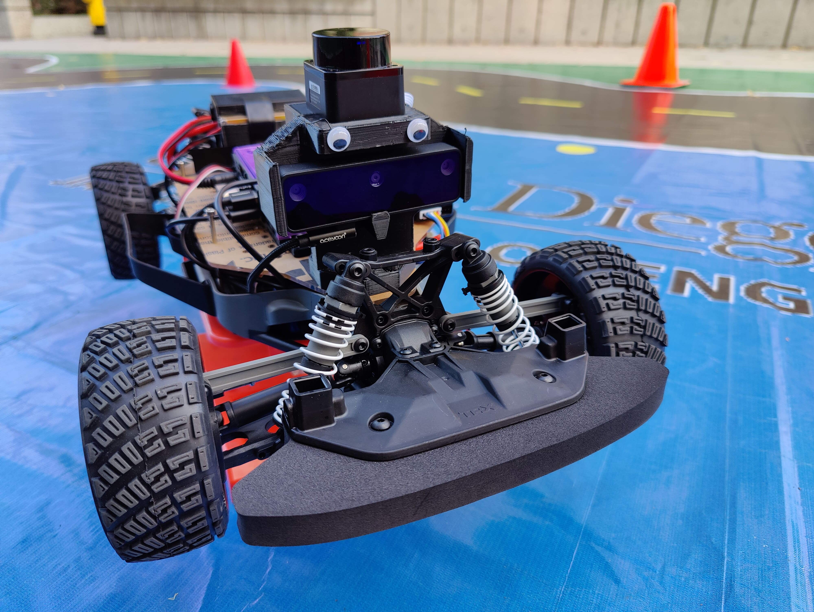
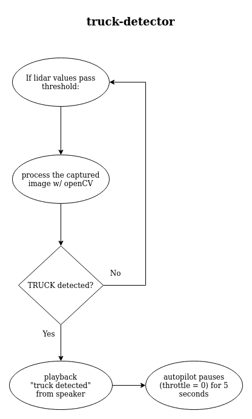
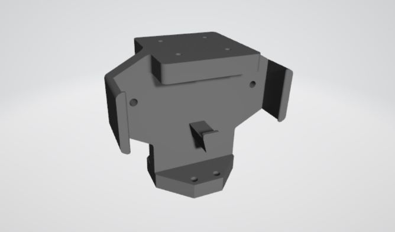
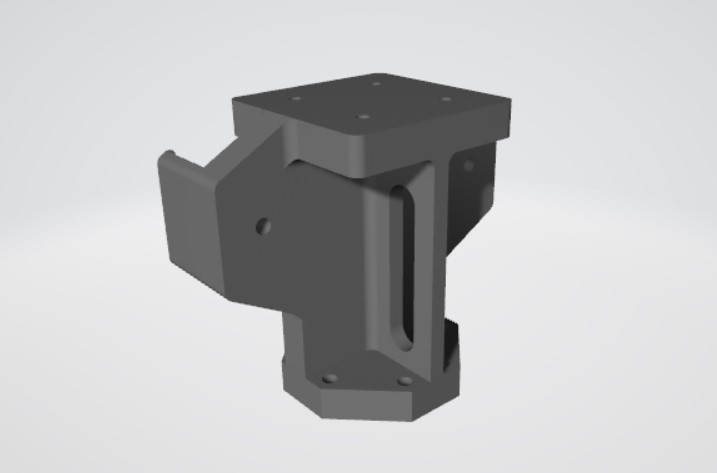
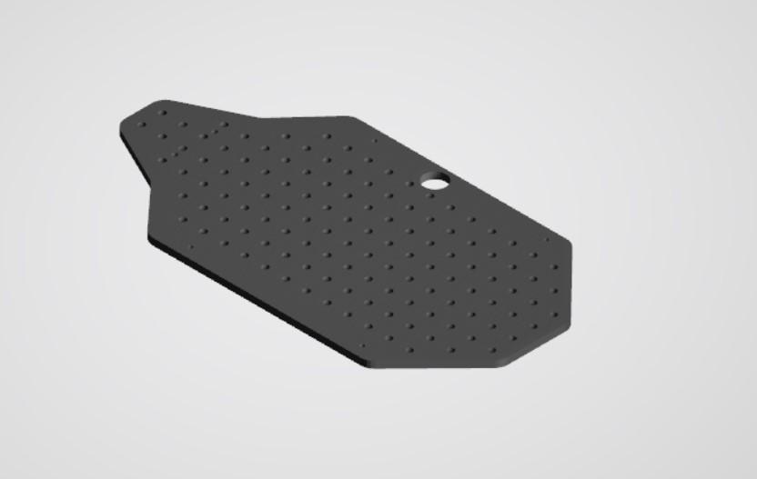

# truck-detector
Detect images of trucks using OpenCV on an autonomous vehicle to initiate an emergency brake, disable autopilot, and play an alarm.

[ECE 148: Autonomous Vehicles @ UCSD](https://guitar.ucsd.edu/maeece148/index.php/Introduction_to_Autonomous_Vehicles)

## Team 5 - Summer 2022
Myat Ei Mon - "Amy" (Mechanical & Aerospace Engineering)  
Uriel Salazar - "Uri" (Electrical & Computer Engineering)  
Hongyuan Zhang - "Ray" (Mechanical & Aerospace Engineering)  

## Demo
**insert YouTube link here...**

## Abstract
Tesla vehicles have had a history of fatal accidents when in autopilot due to being unable to recognize semi trucks. Semi trucks bypass the image recognition system in the autopilot system and results in head-on collisions. Our proposed Vehicle Identification & Alarm System will identify images of vehicles along the track by adding a speaker and announcing the vehicle type: "Semi Truck Detected," "Bus Detected," "SUV Detected," "Sedan Detected," etc. 

## Gantt Chart

## Flow Chart

## Hardware
##### Camera Mount
> This design is meant to hold a camera and lider on top.  
 

##### Bast Plate

## Schematic

## Software
