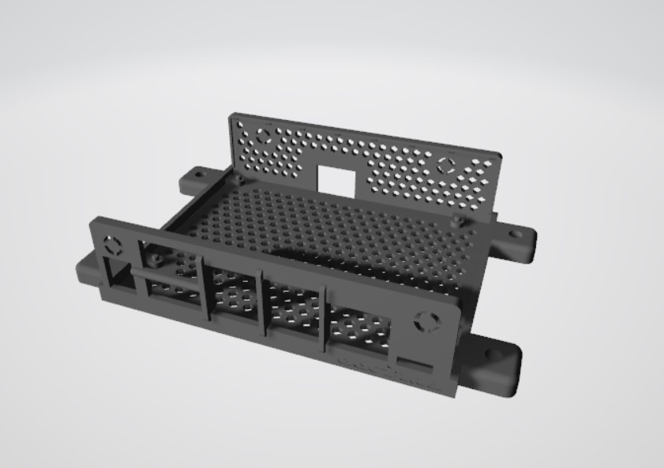
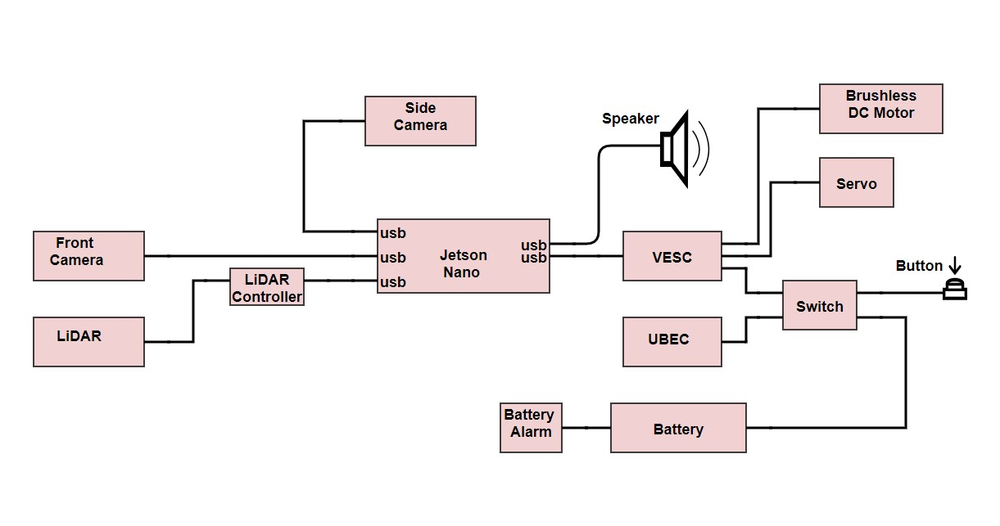

# Truck-detector
Detect images of trucks using OpenCV on an autonomous vehicle to initiate an emergency brake, disable autopilot, and play an alarm.

[ECE 148: Autonomous Vehicles @ UCSD](https://guitar.ucsd.edu/maeece148/index.php/Introduction_to_Autonomous_Vehicles)

## Team 5 - Summer 2022
Myat Ei Mon - "Amy" (Mechanical & Aerospace Engineering)  
Uriel Salazar - "Uri" (Electrical & Computer Engineering)  
Hongyuan Zhang - "Ray" (Mechanical & Aerospace Engineering)  

## Demo
**insert YouTube link here...**

## Abstract
Tesla vehicles have had a history of fatal accidents when in autopilot due to being unable to recognize semi trucks. Semi trucks bypass the image recognition system in the autopilot system and results in head-on collisions. Inspiring from the incidents of Tesla, our proposed Vehicle Identification & Alarm System will identify images of vehicles along the track by adding a speaker and announcing the vehicle type: "Semi Truck Detected," "Bus Detected," "SUV Detected," "Sedan Detected," etc. The purpose of this project is to utilize ROS2 (Robotic Operating System) and Docker containers to develop software, and incooperate them into the hardwares of donkey car such as NVIDIA Jetson Nano, OAK_D webcam to enable autonomous driving. And we also used YOLO (You Only Look Once) algorithm, a real-time object recognition algorithm, to classify and localize objects in a single frame. 

## Gantt Chart

## Flow Chart

## Hardware

### List of Components
- NVIDIA Jetson Nano 
  - A single-board computer (SBC) that delivers the power of AI to run multiple applications like image classification, object detection, segmentation, and speech process. (https://developer.nvidia.com/embedded/jetson-nano-developer-kit)
- OAK_D camera
  - A camera installed at the front of our robot to detect lane and drive autonomously. 
- Webcam
  - A camera installed at the side of our robot to detect the images. 
- LiDAR
- LiDAR Controller
- VESC
- UBEC
- Battery
- Switch
- Servo
- Brushless DC Motor
- Button
- Battery alarm

## CAD Designs

###### Camera Mount

This design is meant to hold a camera and lider on top.  

 

###### Bast Plate

###### Jetson Nano Case
   

## Electrical Schematic

## Software

## Project Summary
Our car will be able to use computer vision to detect, and follow the yellow line on the lane by itself using ROS2, and at the same time, it will also be able to classify the images of vehicles detected along its way. Once it detects the images, the speaker will announce the vehicle type detected. In order to multitask, we used two cameras: one at the front (OAK_D) for lane detection to drive autonomously, and one on the side (webcam) for openCV image processing to classify vehicles images. 

#### Potential Improvements

## Presentation
https://docs.google.com/presentation/d/16iEh1bHuT3R_3_7SF7uTyubHSdH6euG_2twNoYl6GsI/edit#slide=id.p

## Acknowledgement

Speacial THANKS to our Professor and supportive TAs
- Professor Jack Silberman
- TA Ivan Ferrier
- TA Dominic Nightingale
